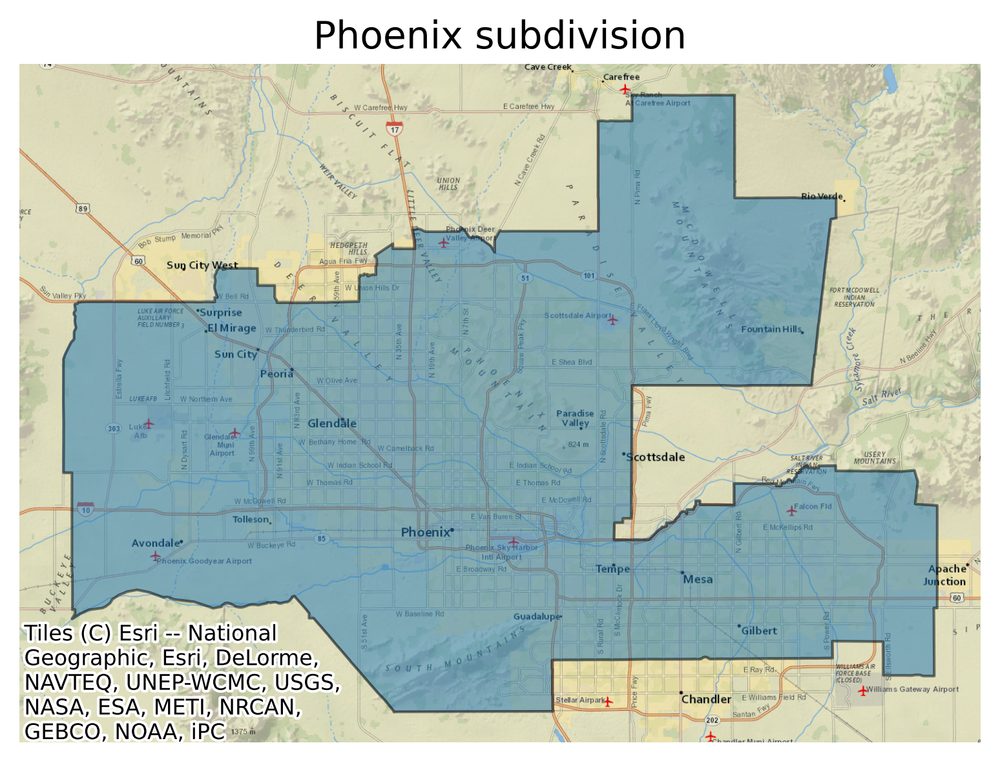
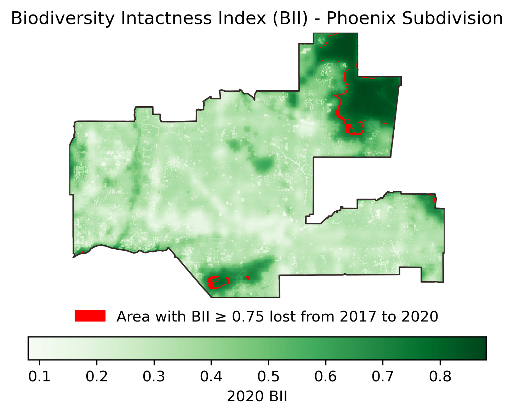

## Biodiversity Intactness Index change in Phoenix subdivision

### Objective
The notebook provides a step-by-step data analysis of calculating and mapping the loss in biodeversity within Phoenix subdivision from 2017 to 2020.

The final outputs of the analysis include:

- A **Map** depicting Phoenix Subdivision within the geographic context</br>


- A **Map** of the BII loss in Phoenix Subdivision from 2017 to 2020.</br>


### Datasets description

- Biodiversity Intactness Index (BII) raster data: this dataset is part of [the MPC STAC catalog](https://planetarycomputer.microsoft.com). I used the ‘io-biodiversity’ collection to extract rasters covering Phoenix subdivision in 2017 and 2020. 
    - Phoenix Subdivision Bounding box: [-112.826843, 32.974108, -111.184387, 33.863574]


- Phoenix subdivision shape file: You will find the Phoenix subdivision polygon in [the Census County Subdivision shapefiles for Arizona](https://www.census.gov/cgi-bin/geo/shapefiles/index.php?year=2022&layergroup=County+Subdivisions)

### File structure

```html
├── .gitignore
├── LICENSE
├── README.md
├── biodiversity_index_phoenix.ipynb
├── data
│   └── tl_2022_04_cousub
│       ├── tl_2022_04_cousub.cpg
│       ├── tl_2022_04_cousub.dbf
│       ├── tl_2022_04_cousub.prj
│       ├── tl_2022_04_cousub.shp
│       ├── tl_2022_04_cousub.shp.ea.iso.xml
│       ├── tl_2022_04_cousub.shp.iso.xml
│       └── tl_2022_04_cousub.shx
└── images
    ├── bii_loss.png
    └── phoenix_subdivision.png
```

[1] Levitt, Zach, and Jess Eng. “Where America’s Developed Areas Are Growing: ‘Way off into the Horizon.’” [Washington Post](https://www.washingtonpost.com/nation/interactive/2021/land-development-urban-growth-maps/). Accessed 13 Dec. 2023.
<br>
[2] Levitt, Zach, and Jess Eng. “Where America’s Developed Areas Are Growing: ‘Way off into the Horizon.’” [Washington Post](https://www.washingtonpost.com/nation/interactive/2021/land-development-urban-growth-maps/). Accessed 13 Dec. 2023.
<br>
[3] [Microsoft Planetary Computer](https://planetarycomputer.microsoft.com/dataset/io-biodiversity). Accessed 13 Dec. 2023.


### Credits
Dr. Carmen Galaz García, Professor for EDS-220 - Environmental Data</br>
Yutian Fang, Teaching Assistant for EDS-220 - Environmental Data</br>
Bren School of Environmental Science & Management</br>
University of California, Santa Barbara
